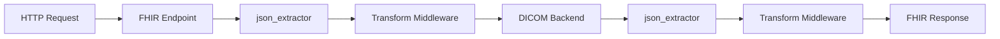

# FHIR ImagingStudy Implementation Guide

This guide provides a complete implementation example for FHIR ImagingStudy endpoints that query DICOM backends using harmony-proxy.

## Quick Start

### 1. Use the JOLT Transform Approach (Recommended)

The JOLT transform approach requires no code changes and uses declarative JSON mapping:

```bash
# Start harmony-proxy with the provided configuration
./harmony-proxy --config examples/config/pipelines/fhir_imagingstudy.toml
```

### 2. Test the Endpoint

```bash
# Test with mock backend
curl -s "http://localhost:8081/ImagingStudy?patient=PID156695" \
  -H "Accept: application/fhir+json" | jq .

# Run comprehensive tests
./scripts/test_imagingstudy.sh
```

### 3. Expected Response

The endpoint returns FHIR R4 Bundle with ImagingStudy resources:

```json
{
  "resourceType": "Bundle",
  "type": "searchset",
  "total": 2,
  "entry": [
    {
      "resource": {
        "resourceType": "ImagingStudy",
        "id": "1.2.826.0.1.3680043.9.7133.3280065491876470",
        "identifier": [
          {
            "system": "urn:dicom:uid",
            "value": "1.2.826.0.1.3680043.9.7133.3280065491876470"
          },
          {
            "system": "http://example.org/studyid",
            "value": "1"
          }
        ],
        "status": "available",
        "subject": {
          "reference": "Patient/PID156695",
          "display": "Doe^John"
        },
        "started": "2024-10-15T12:00:00Z",
        "description": "Mock CT Study"
      }
    }
  ]
}
```

## Architecture

### Data Flow



### Key Components

1. **FHIR Endpoint**: Handles `/ImagingStudy?patient={id}` requests
2. **json_extractor**: Processes request/response JSON
3. **Transform Middleware**: Maps DICOM JSON to FHIR Bundle
4. **DICOM Backend**: Executes C-FIND STUDY queries

## Implementation Files

### Core Implementation (Approach A - JOLT Transform)

- **[docs/fhir_imagingstudy.md](docs/fhir_imagingstudy.md)**: Complete documentation
- **[examples/config/transforms/dicom_to_imagingstudy.json](examples/fhir_dicom/transforms/dicom_to_imagingstudy.json)**: JOLT mapping specification
- **[examples/config/pipelines/fhir_imagingstudy.toml](examples/fhir_dicom/pipelines/fhir_imagingstudy.toml)**: Pipeline configuration

### Test Resources

- **[samples/dicom/find_studies_by_patient.json](samples/dicom/find_studies_by_patient.json)**: Sample DICOM backend response
- **[scripts/test_imagingstudy.sh](scripts/test_imagingstudy.sh)**: Comprehensive test script

## Configuration Options

### Production Configuration

For production use with real DICOM servers:

```toml
[backends.dicom_backend]
service = "dicom"
[backends.dicom_backend.options]
local_aet = "HARMONY_SCU"
aet = "YOUR_PACS_AET"
host = "your-pacs-server.com"
port = 104
```

### Development Configuration

For development and testing:

```toml
[backends.dicom_backend]
service = "mock_dicom"
```

### Authentication

Add authentication middleware:

```toml
middleware = [
    "middleware.jwt_auth",  # or basic_auth
    "middleware.json_extractor",
    "middleware.dicom_to_fhir_transform"
]
```

## Field Mappings

| DICOM Tag | DICOM Field | FHIR Field | Notes |
|-----------|-------------|------------|-------|
| `0020000D` | StudyInstanceUID | `id`, `identifier[0].value` | Primary identifier |
| `00100020` | PatientID | `subject.reference` | `Patient/{PatientID}` |
| `00100010` | PatientName | `subject.display` | Optional display name |
| `00080020` | StudyDate | `started` (date part) | Combined with StudyTime |
| `00080030` | StudyTime | `started` (time part) | ISO 8601 format |
| `00081030` | StudyDescription | `description` | Study description |
| `00200010` | StudyID | `identifier[1].value` | Secondary identifier |

## Testing

Run the comprehensive test suite:

```bash
./scripts/test_imagingstudy.sh
```

Tests include:
- Valid patient queries
- Unknown patient handling
- Missing parameter validation
- Content-Type verification
- Performance benchmarking

## Advanced Implementation (Approach B)

For custom requirements, you can implement a dedicated Rust middleware. See the TODO items for:

- Custom `FhirImagingStudyMiddleware` implementation
- Advanced error handling
- Performance optimizations
- Extended FHIR resource support

## Next Steps

1. **Deploy**: Configure with your DICOM server settings
2. **Extend**: Add series and instance level queries
3. **Integrate**: Connect with FHIR clients and EMR systems
4. **Monitor**: Add logging and metrics for production use

For detailed implementation guidance, see [docs/fhir_imagingstudy.md](docs/fhir_imagingstudy.md).

## Support

- Review the comprehensive documentation in `docs/fhir_imagingstudy.md`
- Test with provided sample data and scripts
- Use mock backend for development and testing
- Check the transform specification for field mapping details